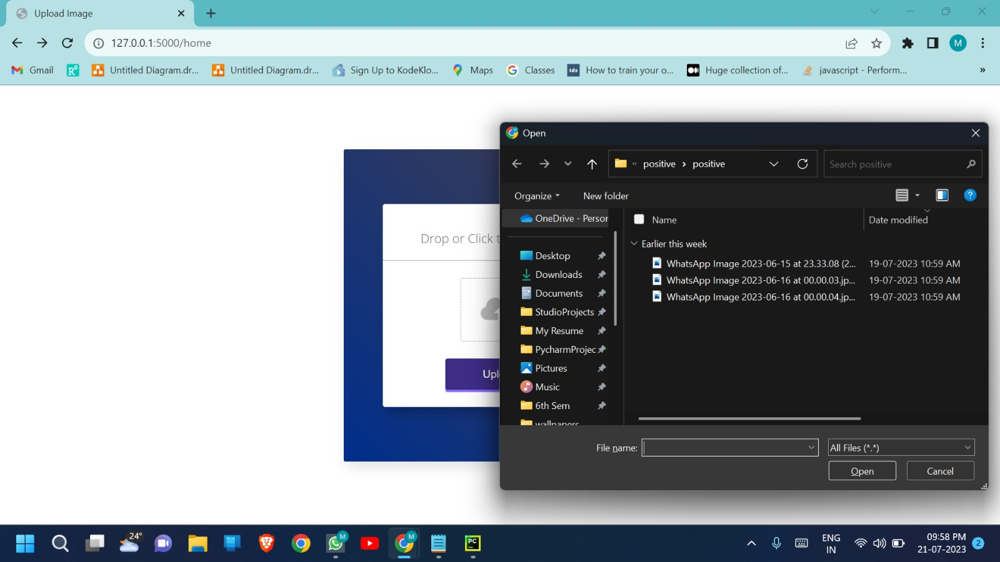

# Tuberculosis-Detection🧑‍⚕️🩺

## Description
- The Tuberculosis Detection app is an innovative solution leveraging Convolutional Neural Networks (CNN) in sequential mode to detect the presence of tuberculosis in medical images. By simply uploading an image, users can receive an accurate diagnosis along with the percentage indicating the likelihood of the presence of tuberculosis or the image being normal.

- Early detection of tuberculosis plays a vital role in effective treatment and prevention of the disease. This cutting-edge app aims to assist healthcare professionals and individuals in identifying potential cases of tuberculosis promptly, aiding in timely interventions and reducing the risk of further transmission.

## Features
#### Efficient Tuberculosis Detection:
- The app utilizes a CNN model trained on a vast dataset of tuberculosis-related images to deliver reliable detection results.
#### Image Upload:
- Users can easily upload medical images directly from their devices to initiate the tuberculosis detection process.
#### Real-time Analysis: 
- The app analyzes the uploaded image in real-time, providing instantaneous results for efficient decision-making.
#### Diagnostic Confidence: 
- The result displayed includes a percentage indicating the likelihood of tuberculosis presence or the image being normal, empowering users with valuable insights for further investigation.
#### User-friendly Interface: 
- The intuitive and user-friendly interface ensures seamless navigation and an optimized user experience.

 

## CNN Architecture

 

 

## Login Page

 

## Upload Page

 

## Dashboard Page

 

## Database

